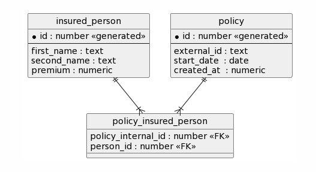

# Insurance Example Project

## Project Set up

The project benefits from the following:

+ [H2](https://en.wikipedia.org/wiki/H2_(DBMS)) in memory database
+ [Lombok](https://projectlombok.org/) library

## In Memory Database Console
http://localhost:8080/h2-console
+ username: user
+ password: password

### DB Migration and Test Data
The application uses [Flyway](https://flywaydb.org/) for database migration and prepares initial test data. 

## Build and Run the Application
To build the application run the following:
+ `./mvnw clean install`

To run the application run the following, the application will start on port `8080`:
 + `java -jar ./target/insurance-example-0.0.1-SNAPSHOT.jar`

## Application Rest Endpoints
The application provides the following endpoints:

+ `http://localhost:8080/policies/create`
+ `http://localhost:8080/policies/modify`
+ `http://localhost:8080/policies/{policy-id}?requestDate={request-date}`

## Data Structure

+ Each policy has an internal auto incremented id and an external id (UUIDv4) known by outside the system. This way an external id of a policy can translate into a different
  states of the policy depending on the effective/start date.
+ `insured_person` table keeps person data, and it assigns an auto-increment id to each person.

+ `policy_insured_person` table holds the relationship between a policy and persons assigned to it. Since a policy can have multiple states, in this table `policy_internal_id` is used
  instead of the externally known policy id.

## Test
+ You may use the Postman collection that includes example requests in the following files:
+ `src/main/resources/test/policy-api.postman_collection.json`
